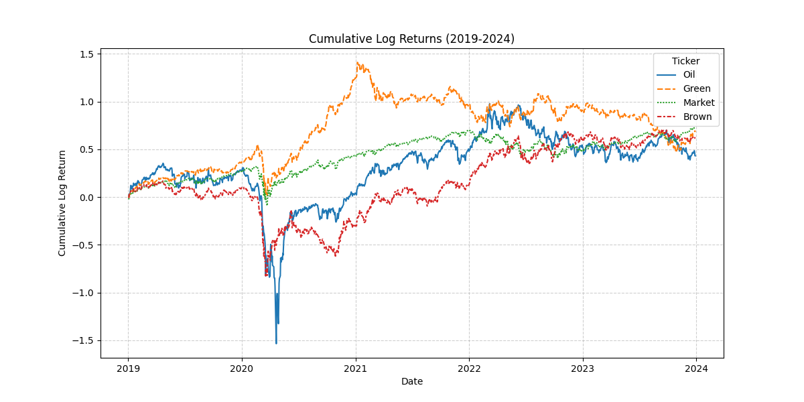
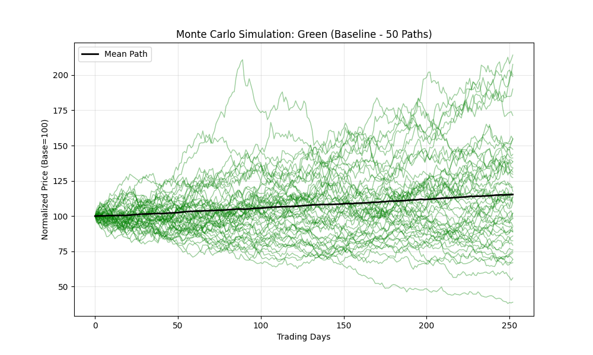
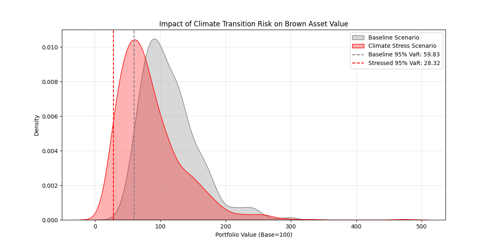
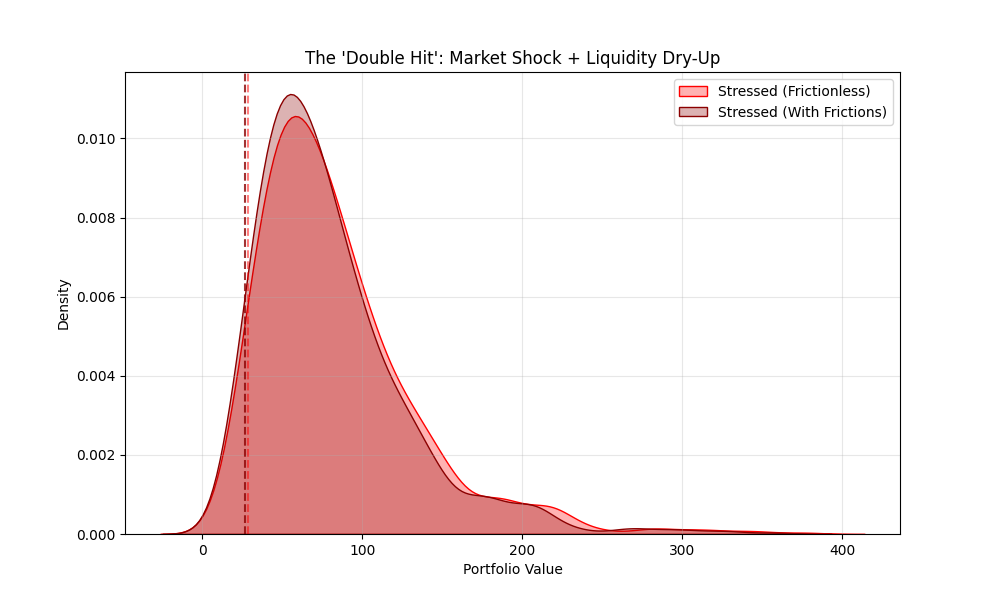

<div align="center">
  <a href="report.pdf">
    
  </a>
  <p><em>Click the banner to view the full analysis report</em></p>
</div>

# Climate Risk Stress Testing under Frictions 🌍📉

<div align="center">


</div>

## 📌 Project Overview

**How much capital do banks lose when "Brown" assets become illiquid?**

Standard financial stress tests (VaR / ES) assume **frictionless markets** — infinite liquidity and zero transaction costs. This capstone project challenges that assumption. By building a **Monte Carlo Stress-Testing Engine**, this project quantifies how **market frictions** (transaction costs and liquidity drying up) amplify losses during a disorderly climate transition (e.g. a sudden carbon tax).

**The core thesis:** ignoring liquidity frictions leads to a dangerous underestimation of tail risk for ESG-sensitive portfolios.

> 📄 Full write-up, including derivations, literature review, and appendices, is available in [`report.pdf`](report.pdf).

---

## 📊 Key Results

### 1. The "Double Hit" Phenomenon

Under a Climate Stress Scenario, the portfolio's Value-at-Risk degrades **twice**: first from the direct price shock, then again from the liquidity spiral as spreads widen and market depth evaporates.

### 2. Quantitative Impact

| Metric | Baseline Scenario | Stressed Scenario | Insight |
| :--- | :---: | :---: | :--- |
| **95% VaR (Frictionless)** | $56.62 | $28.38 | Market shock alone wipes out ~50% of value. |
| **Liquidity Haircut** | 2.50% | **5.00%** | Cost of selling **doubles** as volatility spikes. |
| **Final Adjusted VaR** | $55.21 | **$26.96** | Frictions amplify the total loss significantly. |

For a hypothetical **$1 billion** fund, the friction-driven gap between the naive and liquidity-adjusted VaR translates into roughly **$25 million** of unmodeled risk — capital that a standard, frictionless model would never ask a bank to hold.

### 3. Figure Gallery

| Figure | Preview | Description |
| :--- | :---: | :--- |
| **Cumulative Log Returns (2019–2024)** |  | Sanity-check of the cleaned input data. Tracks Oil, S&P 500 (SPY), Green Energy (ICLN), and Brown Energy (XLE) over the calibration window — highlights Oil's volatility and the Green/Brown divergence after 2020. |
| **Monte Carlo Simulation — Baseline** |  | 50 simulated portfolio paths (of 1,000) generated by the MV-GBM engine under historical drift and volatility. The "fan" shape shows how uncertainty diffuses over the 1-year horizon. |
| **Stress Test: Portfolio Value Distribution** |  | Terminal portfolio value at T = 1 year, Baseline (grey) vs. Climate Stress (red). The stressed distribution is shifted left with a visibly fatter loss tail. |
| **The "Double Hit": Market Shock + Liquidity Dry-up** |  | Portfolio value after layering the liquidity penalty on top of the market shock. The dark red area is value destroyed strictly by frictions, on top of the price shock alone. |

---

## 🧮 Methodology at a Glance

- **Multivariate Geometric Brownian Motion (MV-GBM):** simulates correlated asset paths for Oil, Green Energy (ICLN), and Brown Energy (XLE) against the S&P 500 (SPY) benchmark.
- **Cholesky Decomposition:** decomposes the historical covariance matrix (Σ = LLᵀ) to inject realistic cross-asset correlation into the simulated shocks.
- **Disorderly Transition Scenario:** a -30% annualized drift shock to Brown assets combined with a 1.5x volatility multiplier.
- **Quadratic Liquidity Model:** $C(\sigma) = \text{Spread}_{base} + \lambda\left(\frac{\sigma_{stress}}{\sigma_{base}}\right)^2$, so transaction costs scale with the *square* of volatility — modeling how market makers widen spreads sharply as panic sets in.
- **Liquidity-Adjusted VaR:** extends the classic Bangia et al. (1999) L-VaR framework specifically to ESG / climate-transition stress testing.

---

## 🛠️ Technical Implementation

* **Language:** Python (NumPy, Pandas, SciPy)
* **Data Source:** Yahoo Finance API (`yfinance`) — daily adjusted closes, 2019–2024
* **Asset Universe:**

| Ticker | Instrument | Role |
| :--- | :--- | :--- |
| `XLE` | Energy Select Sector SPDR | Brown Asset |
| `ICLN` | iShares Global Clean Energy ETF | Green Asset |
| `SPY` | SPDR S&P 500 ETF Trust | Market Benchmark |
| `CL=F` | Crude Oil WTI Futures | Macro Factor |
| `^TNX` | CBOE 10-Year Treasury Yield | Risk-Free Rate |

* **Modeling Approach:**
    * **Multivariate Geometric Brownian Motion (MV-GBM):** to simulate correlated asset paths.
    * **Cholesky Decomposition:** to maintain historical correlations between Oil, Green Energy, and Brown Energy.
    * **Quadratic Liquidity Model:** to model liquidity drying up during panic.

### Repository Structure
```bash
├── data
│   ├── raw              # Raw downloads (yfinance)
│   └── processed        # Cleaned log-returns (market_returns.csv)
├── notebooks
│   ├── 01_data_acquisition.ipynb    # Data fetch & cleaning
│   ├── 02_model_calibration.ipynb   # GBM calibration & stress testing
│   └── 03_liquidity_frictions.ipynb # Final liquidity-adjusted VaR
├── outputs
│   ├── figures          # PNG plots for the report
│   └── tables           # CSV results
├── src                  # Modular Python scripts
└── requirements.txt     # Dependency list
```

---

## 🚀 How to Run

1. **Clone the repository**
   ```bash
   git clone https://github.com/sanaurrehmanarain/climate-risk-stress-testing.git
   cd climate-risk-stress-testing
   ```
2. **Install dependencies**
   ```bash
   pip install -r requirements.txt
   ```
3. **Run the pipeline**
   Execute the notebooks in order (`01` → `02` → `03`) to reproduce the figures and tables above.

---

## 🔭 Future Work

- **Non-linear correlations:** replace Cholesky with Copulas to capture tail-dependence (correlations → 1 during crashes).
- **Order book modeling:** simulate a Limit Order Book (LOB) to derive bid-ask spreads mechanistically instead of via a heuristic cost function.
- **Portfolio optimization:** build a "Climate-Resilient Frontier" optimizer that minimizes liquidity-adjusted VaR directly.

---

## Citation

If you use this project in academic research, publications, educational materials, or derivative works, please cite it and provide appropriate credit to the original author. A [`CITATION.cff`](CITATION.cff) file is included, so GitHub also provides a **"Cite this repository"** button in the sidebar (BibTeX, APA, and other formats).

**Suggested citation:**

> Arain, S. U. R. (2026). *climate-risk-stress-testing* (Version 1.0) [Software]. https://github.com/sanaurrehmanarain/climate-risk-stress-testing

| | |
|---|---|
| **Author** | Sana Ur Rehman Arain |
| **Role** | Data Scientist |
| **GitHub** | [@sanaurrehmanarain](https://github.com/sanaurrehmanarain) |
| **Contact** | sana.arain.work@gmail.com |

---

## 📜 License

This project is licensed under the **MIT License** — see [LICENSE](LICENSE) for details. The license requires that the original copyright notice be retained in copies of the software.

---

<p align="center">
⭐ If this project was useful to you, consider starring the repo — it helps others discover it and supports future work.
</p>
